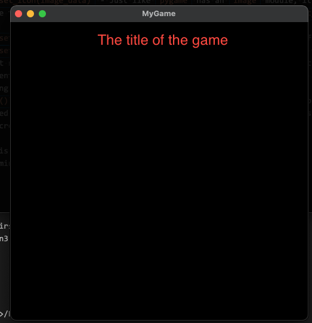
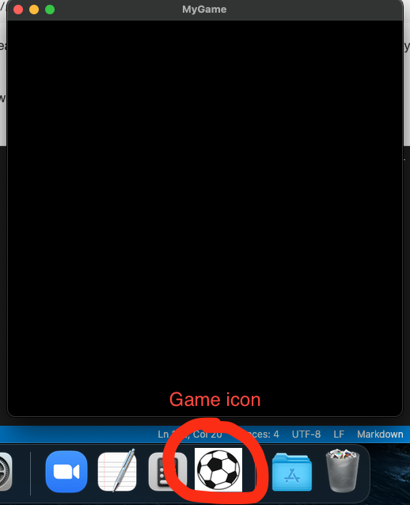

# Pygame

## Links

* [Pygame home](https://www.pygame.org/news)
* [Pygame getting started](https://www.pygame.org/wiki/GettingStarted)
* [Pygame tutorials](https://www.pygame.org/wiki/tutorials)
* [Pygame API documentation](https://www.pygame.org/docs/)

## Introduction

### What is pygame?

pygame is a library which enables you to write video games and multimedia programs in python. pygame is free for use in personal and commercial software projects under certain licenses. If you are interested in reading about pygame further, please refer to the home page above and navigate to the "About" section on their website.

### Why pygame?

Video games are complex pieces of software. There is a lot that goes behind in making a video game - right from the game logic to other aspects like displaying game animation, processing etc.. Game and multimedia libraries help us in taking care of a few things which are common across all games like shapes, screen display etc. pygame is a library just like this aimed at taking care of features which are common across games leaving you to only focus on the game logic and flow.

### How do we use pygame?

The objective of this course is to enable you to use pygame and teach you about pygame APIs, which you can then use to write any game or multimedia application. At the end of this course, you should be able to write a game using pygame and python.

## Installation and setup

To be able to use pygame, we first need to make sure that pygame is installed on our machine. This can be done via pip - python's package manager.

Let's start setting up our first project where we explore pygame and its components.

Open any directory where you want to create your game. Let us say `D:\Projects\MyFirstPyGame`.
To do this, open command prompt (you can do this by searching for cmd in windows or terminal in mac).

### Creating a virtual environment

Whenever we write code, it is possible that we use a library across multiple projects. However, it is possible that for one project, that library may be required to be at a different version. But this might break our other projects. So what do we do? We isolate these kind of libraries and install them specifically in our project and not globally. Python has a feature called as virtual environment, which helps you create a sandbox in your working folder, and all your packages or some of your packages can be then installed in that folder. This means that packages that you install globally will be visible to your projects, but any packages and libraries that you install in this project workspace, will only be visible to this project, which helps in isolating projects from sudden changes.

### Workspace set up and installing pygame

Let us start giving our first game project some shape. But to do this we need to store our files like images, videos, code in some folder, right? To do this, we create a new set of folders which will help us create such a workspace.

To do so, we can use some command line tools. We will follow a directory structure like this to help us keep our project clean.

`D:\Projects\MyFirstPyGame`

```txt
D:\Projects\MyFirstPyGame
|--src
|--resources
|--docs
```

`src` folder will hold all our code. `resources` folder will contain all our images, videos, gifs etc. `docs` folder will contain any documentation we want to make for our game.

To make this kind of a folder structure, you can follow these commands.
For a windows system

```cmd
mkdir D:\Projects\MyFirstPyGame
cd D:\Projects\MyFirstPyGame
mkdir src
mkdir docs
mkdir resources
```

For a mac osx system you can execute these commands.

```bash
mkdir /User/<username>/Projects/MyFirstPyGame
cd /User/<username>/Projects/MyFirstPyGame
mkdir src
mkdir docs
mkdir resources
```

We will now install pygame. How? We first need to create our virtual environment in our root folder or working directory. Remember, root folder or working directory is nothing but where you will keep all your game related files like code, images, videos etc..

For windows

```cmd
cd D:\Projects\MyFirstPyGame
python3 -m venv venv
venv\Scripts\pip3 install pygame
```

For mac osx

```bash
cd /User/<username>/Projects/MyFirstPyGame
python3 -m venv venv
venv/bin/pip3 install pygame
```

## First pygame program

It is always a good idea to start with an example program and see various parts of it and then understand what those parts do. We can then customize our code to our needs once we understand what is needed and what is not.

Let us take a look at some basic code to get us started. You can find the code [here](./src/game_main.py).

We will discuss this one line at a time to see what each statement is doing.

```python
import pygame
```

This imports the pygame module in our code. we will use this import ahead to call our functions and use and manipulate surface and screen objects.

There are a few other imports, which are useful in the code for completing paths and also helping us with printing some information on the console.

```python
logging.basicConfig(
    format="[%(asctime)s] [%(levelname)-10s] %(message)s", level=logging.DEBUG)
```

This piece of code just initializes the logger. A logger is nothing but a utility which helps do some print statements in a more information rich way. This utility allows us to print various types of messages like error, exception and normal debug lines with formatting and some time stamps.

If you scroll down, you will see that we have written something like this

```python
if __name__ == "__main__":
    main()
```

Whenever you run python code, the file that you pass to python, e.g. `python my_python_script.py` becomes the `main` file. It is useful when you have many python files, and you want to define a starting point for your code. `__name__` is an attribute that you can get the name of the currently executing context. This means that if this file was not launched like `python game_main.py`, `
`__name__` will not be `"__main__"`.

__You will encounter a few important functions ahead which we will extensively use to actually display our game elements and control them. These are__

* `pygame.display.set_mode` - the `set_mode` function in the `display` module takes a few parameters about the actual game display like screen height, width, color depth etc. It returns a `Surface` object which nothing but a object to display things on our screen. Our game will make extensive use of this `screen` object ahead. Currently, we pass the width and height of our game window, and we also allow the game screen to be resizable and scale it to our display. Scaling and resizing are optional and you can ignore them for now.
* `pygame.even.get()` - Every activity that you do - moving your mouse, mouse click, button press etc. are all **events**. All actions that you make in the future will be based on these events and we will see how to control and display things based on these events. e.g. we could control the movement of our character on the screen using events generated by arrow keys.

Now, let us take a look at the contents of the function itself.

```python
def main():
    # init the python game module.
    num_of_ok_init, num_of_bad_init = pygame.init()
    logging.info("Number of successful inits {}. Number of bad inits {}".format(
        num_of_ok_init, num_of_bad_init))

    # check if the game is correctly init.
    if pygame.get_init() == False:
        return

    logging.info("Game initialized. Starting..")

    # Set a logo. Recommended file formats for images are .jpeg and .png
    game_logo_path = os.path.join(os.path.dirname(
        __file__), "..", "resources/my_game_icon.jpeg")
    logging.debug("Icon resource path - {}".format(game_logo_path))
    game_logo = pygame.image.load(game_logo_path)
    pygame.display.set_icon(game_logo)

    logging.debug("Set game window logo..")

    # Set a window title
    pygame.display.set_caption("MyGame")

    # set up the window of the game
    screen = pygame.display.set_mode(size=(200, 200))
    game_running = True

    while game_running:
        for event in pygame.event.get():
            if event.type == pygame.QUIT:
                game_running = False
```

Let us take a closer look at pygame specific functions in the code.

* `pygame.init()` - the init function in `pygame` module initializes a few modules, which are required to run and create a game. Once we call this function, if there were any failures in initializing the modules, we get a count of number of failed and successful initializations.
* `pygame.get_init()` - this functions tells us if the modules were initializes successfully. This is useful, because sometimes the count of failed and successful initializations could be both greater than `0`.
* `pygame.image.load("path to image")` - `pygame` has an `image` module, which handles images. If you want to load images to be used by the pygame module, we need to use functions inside the `image` module. Here, we use the `load` function to read an image from our hard disk, which we will use to set our game logo.
* `pygame.display.set_icon(image_data)` - Just like `pygame` has an `image` module, it also has an `display` module, which controls everything related to the display of the game that you make. We first use it to set our game icon using the `set_icon` function, which takes the above object from the `pygame.image.load` function.
* `pygame.display.set_caption("title")` - the `set_caption` function sets the title of our game window.


Now, let us run this code.
Open your cmd/ terminal, and run the following commands

On windows
]
```cmd
cd D:\Projects\MyFirstPyGame
venv\scripts\python3 src\game_main.py
```

On macosx

```bash
cd /User/<username>/Projects/MyFirstPyGame
venv/bin/python3 ./src/game_main.py
```

If you run this code, it creates a `500x500` box which has nothing on it, as we have not drawn anything on the screen.
 

In our future programs, we will discuss how to draw objects on the screen and move them and discuss more about the Surface object and events.
